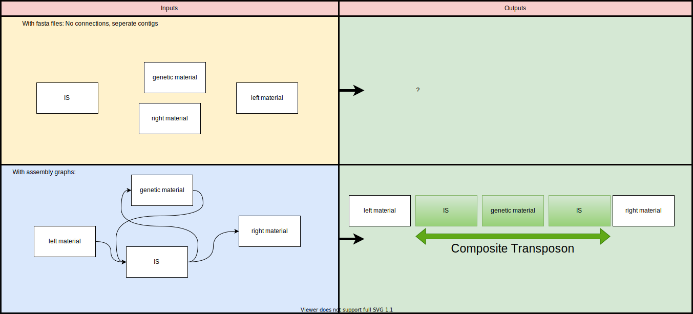

# CMPE549-TermProjectTemplate
A template for term project 

## A tool for *de-novo* Identification of Composite Transposons

### What is a Composite Tranposon?

Transposons are the DNA sequences can alter its position in genome, changing the genome size. Also, they can contribute to genome and gene evolution. Composite transposons are composed of two transposon and genetic material inside the flanking transposons. 

Figure from: PCR-based detection of composite transposons and translocatable units from oral metagenomic DNA

### Why Composite Transposons Are Important? 

They often carry antibiotic genes, and sometimes metabolic genes such as degradation of xenobitiotics and metal resistance. Therefore, they are crucial to find interesting metabolic functions, transfer of antibiotic resistance and 
spread them among organisms. 

### What are the limitations of existing tools?

There are too many tools to find the transposons but there is a few tools related to composite transposons. One of them is [TnComp_finder](https://github.com/danillo-alvarenga/tncomp_finder). The limitation of TnComp_Finder is that it can be only used in complete genomes. For the incomplete genomes, it will probably fail because short-read sequencing (most of the time) is not able to capture composite transposons. Because the genome databases are mostly consists of incomplete genomes, a tool that can work also in incomplete genomes is essential.

### Suggested Improvements

To capture the composite transposons in incomplete genomes, assembly graphs built from the raw reads can be very helpful unlike using fasta sequences (TnComp_Finder uses fasta sequences). Graph algorithms can be used to find transposon motifs and possible composite transposons can be identified even *de-novo*. Then, the candidates can be searched in existing gene databases for functional analysis. 

### Outputs 

The spread of composite transposons can be searched and visuliazed for better understanding with phylogenetic trees. Spread between different species can be shown.
