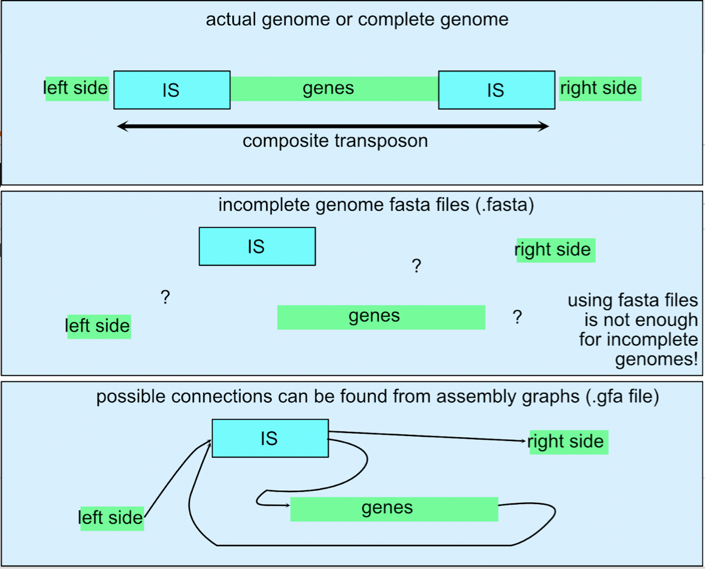
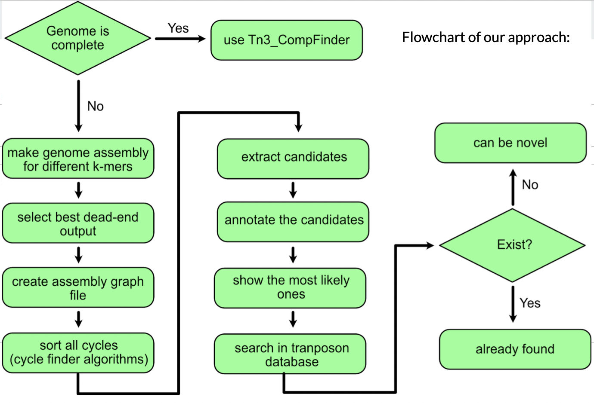
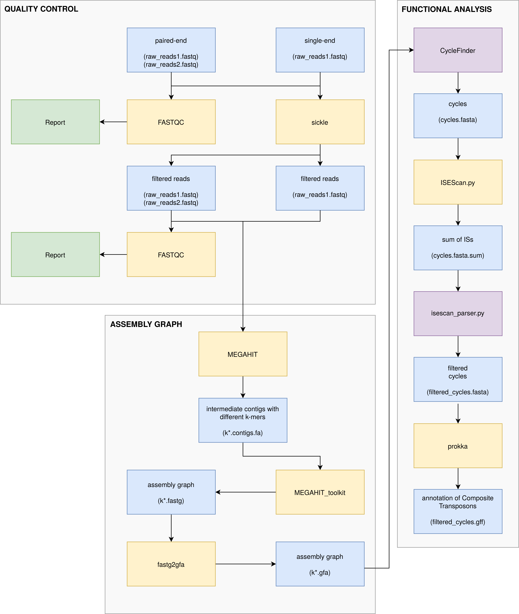

<p align="center">

</p>

## An extendible [P]()ipeline for de-novo [I]()dentification of [CO]()mposite [T]()ransposons from [A]()ssembly graphs (PICOTA)


# Requirements

- Linux (not tested on Windows and MacOS)
- [Phyton](https://www.python.org/) 3.8 or later

## Required Packages 

- [networkx](https://github.com/networkx/networkx) networkx-2.6.3
- [BioPython]() biopython 

## Required Tools

- [ISEScan](https://github.com/xiezhq/ISEScan) ISEScan-1.7.2.3
- [prokka](https://github.com/tseemann/prokka) prokka-1.14.5

# Installation 

Although other environment management systems can also be used, we recommend to use conda:

```
conda update conda --all
conda create --name excota python=3.8
conda activate excota

```

You can use pip to install dependecies

```
pip install isescan
conda install -c conda-forge -c bioconda -c defaults prokka
pip install networkx[all]
```

# An Example Run

This tool is straightforward to use and after the dependencies are installed, the code below should run an example pipeline:

```
python picota.py test_data/raw_input/test.fastq se sanger -o test_out
```
# Possible issues

If you encounter permission denied error, the code below in the programs folder:

```
chmod +577 *
```

### What is a Composite Tranposon?

Transposons are the DNA sequences can mobilize and alter its position in genome, changing the genome size. Also, they can contribute to genome and gene evolution. Composite transposons are composed of two transposon and genetic material inside the flanking transposons. Since transposition event is somewhat stochastic, these transposons that are close to each other can act as one transposon and faciliate the transfer of the genetic material between.

<p align="center">

</p>

Figure from: PCR-based detection of composite transposons and translocatable units from oral metagenomic DNA

### Why Composite Transposons Are Important? 

We are in the brink of a "post-antibiotic" era. As more an more bacteria gain resistance to antibiotics due to misuse and overuse of antibiotics, it is more important now then ever to understand how bacteria transmit antibiotic resistance genes to each other if we don't want to go back to an era where even small scratches are deadly. Composite transposons also often carry antibiotic resistence genes, and sometimes metabolic genes such as degradation of xenobitiotics and metal resistance. Due to the nature of the transposons, these genes can be mobilized and potentially introduced to other bacteria. Therefore, it is crucial to identify and understand composite transposons if we want to understand the transfer of antibiotic resistance between different organisms and find interesting metabolic functions of genes that can be transferred. 

<p align="center">

</p>

### What are the limitations of existing tools?

There are many tools to find the transposons but there is a few tools related to composite transposons. One of them is [TnComp_finder](https://github.com/danillo-alvarenga/tncomp_finder). The limitation of TnComp_Finder is that it can be only used in complete genomes. For the incomplete genomes, it will probably fail because short-read sequencing (most of the time) is not able to capture composite transposons due to repetetive nature of these transposons. Because the genome databases are mostly consists of incomplete genomes, a tool that can work also in incomplete genomes is essential.

<p align="center">

</p>

<p align="center">

</p>

### How Does It Work?

To capture the composite transposons in incomplete genomes, assembly graphs built from the raw reads can be very helpful unlike using fasta sequences (TnComp_Finder uses fasta sequences) since the links that are between different parts of genomics sequences are lost in fasta files. Graph algorithms can be used to find transposon motifs, previously known transposons and possible novel composite transposons can be identified even *de-novo*. Then, the candidates can be investigated in existing gene databases for functional analysis. 

<p align="center">

</p>

### PIPELINE 

<p align="center">

</p>


### Outputs 

Using this tool, previously identified transposon in the incomplete genome of your interest or possible novel composite transposons can be found.


